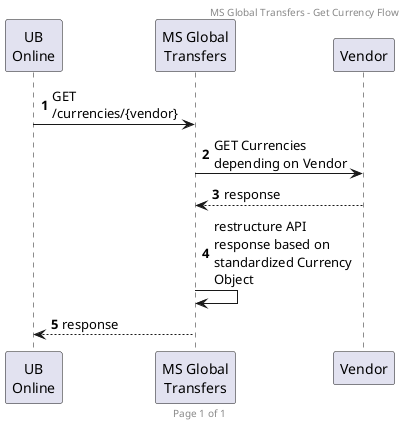

```puml
@startuml  

header MS Global Transfers - Get Currency Flow
footer Page %page% of %lastpage%

participant "UB\nOnline" as ubo
participant "MS Global\nTransfers" as msgt
participant "Vendor" as vendor
  
autonumber  
skinparam maxMessageSize 150

ubo -> msgt: GET /currencies/{vendor}
msgt -> vendor: GET Currencies depending on Vendor
vendor --> msgt: response
msgt -> msgt: restructure API response based on standardized Currency Object
msgt --> ubo: response
  
@enduml
```
