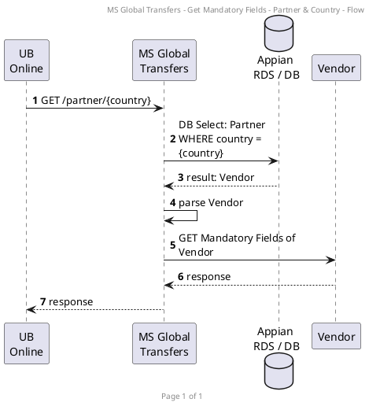

```puml
@startuml  

header MS Global Transfers - Get Mandatory Fields - Partner & Country - Flow
footer Page %page% of %lastpage%

participant "UB\nOnline" as ubo
participant "MS Global\nTransfers" as msgt
database "Appian \nRDS / DB" as db
participant "Vendor" as vendor
  
autonumber  
skinparam maxMessageSize 150

ubo -> msgt: GET /partner/{country}
msgt -> db: DB Select: Partner WHERE country = {country}
db --> msgt: result: Vendor
msgt -> msgt: parse Vendor
msgt -> vendor: GET Mandatory Fields of Vendor
vendor --> msgt: response
msgt --> ubo: response

  
@enduml
```
