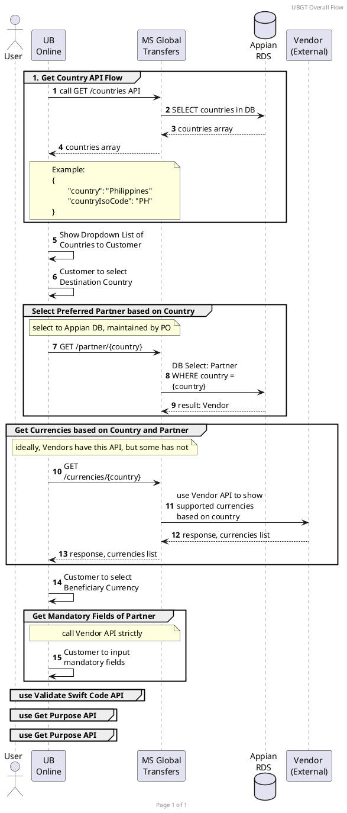

Pre-requisite:
- PO to set-up Currency <-> per Vendor via Appian?
	- dami nito 

UBO Flow
1. ~~Get Countries + Currency API -~~ 
	- ~~request: country~~
	- ~~response: country + currency of that country~~
	- ~~Customer to select Destination Country~~ 
	- ~~Regardless of Partner~~
2. Get Countries API
	1. UBO to show all Countries in Dropdown
2. Select Preferred Partner - request: country
	- select to Appian DB, maintained by PO
- **need to ask Nium + Dandelion if they can give us all supported currencies based on a given country**
	- Dandelion: 
		- For review: https://public.dandelionpayments.com/dandelion/apiPage?id=GetAllowedDeliveryMethods_send-money
	- Nium possible answer: they will show this static table: https://docs.nium.com/apis/docs/currency-and-country-codes
- **Ideal: GET /currencies/{country}** API
1. ~~Show all possible currencies~~
	1. ~~Show in app via Dropdown~~
2. ~~Customer to supply:~~ 
	- ~~currency input~~
	- ~~amount input~~
3.  ~~API to return error if invalid~~ 
4. ~~Validate Currency - use Vendor API dapat~~
	- ~~Dandelion -~~ 
	- ~~Nium - Fetch Corridors V3 tapos ibabangga sa MS against the request?~~
5. 
6. Swift Code input
7. Validate Swift Code - 
	- Dandelion - 
	- Nium - this API: https://docs.nium.com/apis/reference/fetchbankdetailsusingroutingcode~~
8. Get Purpose API 
	- Depende pa rin sa Vendor API kasi iba iba silang Purpose
9. Get Relationships API
	- Depende pa rin sa Vendor API kasi iba iba silang Relationships
10. Get Source of Funds
	- Depende pa rin sa Vendor API kasi iba iba silang Source of Funds
11. Get Fees and Limits API
	- Sa atin ito, maintained by PO
	- not Vendor API
Example (sa SWIFT):
```json
{
  "message": "Request Successful",
  "status": 200,
  "data": {
    "currency": "USD",
    "serviceFee": {
      "type": "OUR",
      "total": 40,
      "breakdown": [
        {
          "description": "Cable Charge",
          "value": 40
        }
      ]
    },
    "limits": {
      "transactional": 20000,
      "daily": 20000,
      "monthly": 10000
    }
  }
}
```

10. GET Remaining Limits
	- Sa atin, sa Appian DB / existing Swift API / existing Finacle API? 

11. Validate Amount

12. Review Transaction
	- recap of all responses / screen bago mag actual create order
14. POST Transaction / Create Order


Parked Questions:
- what part of the flow to select Prohibited Countries?
	- for Nium, may API sila for this
	- for Dandelion - to check
