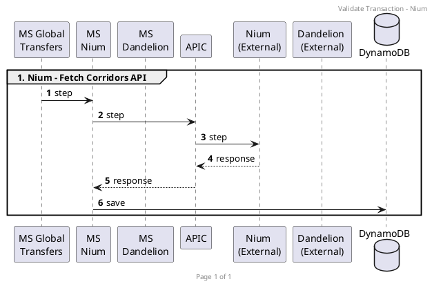

```puml
@startuml  

header Validate Transaction - Nium
footer Page %page% of %lastpage%
  
participant "MS Global\nTransfers" as msgt
participant "MS\nNium" as msnium
participant "MS\nDandelion" as msddl
participant "APIC" as apic
participant "Nium \n(External)" as nium
participant "Dandelion \n(External)" as ddl
database "DynamoDB" as ddb

  
autonumber  

group 1. Nium - Fetch Corridors API
	msgt -> msnium: step
	msnium -> apic: step
	apic -> nium: step
	nium --> apic: response
	apic --> msnium: response
	msnium -> ddb: save
end

  
@enduml
```
