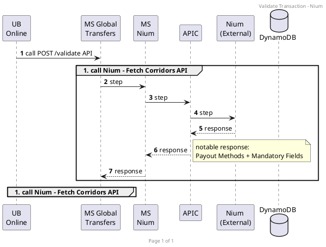
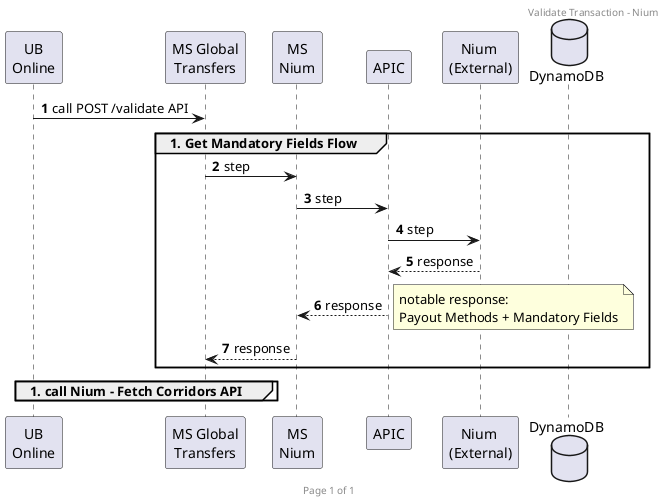

Pre-requisite:
- PO to set-up Currency <-> per Vendor via Appian?
	- dami nito 

UBO Flow
1. Get Countries + Currency API - 
	- request: country
	- response: country + currency of that country
	- Customer to select Destination Country 
	- Regardless of Partner
3. Select Preferred Partner - request: country (path param) & currency
	- select to to Appian DB, maintained by PO
4. Validate Currency - use Vendor API dapat
	- Dandelion - 
	- Nium - Fetch Corridors V3 tapos ibabangga sa MS against the request?
5. Validate Swift Code - 
	- Dandelion - 
	- Nium - this API: https://docs.nium.com/apis/reference/fetchbankdetailsusingroutingcode
6. Get Purpose API 
	- Depende pa rin sa Vendor API kasi iba iba silang Purpose
7. Get Relationships API
	- Depende pa rin sa Vendor API kasi iba iba silang Relationships
8. Get Source of Funds
	- Depende pa rin sa Vendor API kasi iba iba silang Source of Funds
9. Get Fees and Limits API
	- Sa atin ito, maintained by PO
	- not Vendor API
Example (sa SWIFT):
```json
{
  "message": "Request Successful",
  "status": 200,
  "data": {
    "currency": "USD",
    "serviceFee": {
      "type": "OUR",
      "total": 40,
      "breakdown": [
        {
          "description": "Cable Charge",
          "value": 40
        }
      ]
    },
    "limits": {
      "transactional": 20000,
      "daily": 20000,
      "monthly": 10000
    }
  }
}
```

10. GET Remaining Limits
	- Sa atin, sa Appian DB / existing Swift API / existing Finacle API? 

11. Validate Amount

12. Review Transaction
	- recap of all responses / screen bago mag actual create order

14. POST Transaction / Create Order


Parked Questions:
- what part of the flow to select Prohibited Countries?
	- for Nium, may API sila for this
	- for Dandelion - to check
