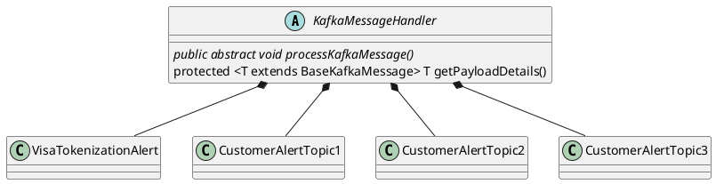

### PlantUML Example
```plantuml
Bob -> Alice : hello
Alice -> Wonderland: hello
Wonderland -> next: hello
next -> Last: hello
Last -> next: hello
next -> Wonderland : hello
Wonderland -> Alice : hello
Alice -> Bob: hello
Bob --> Alice: response
Bob --> Alice: hahahahaha
```


### PlantUML Example



